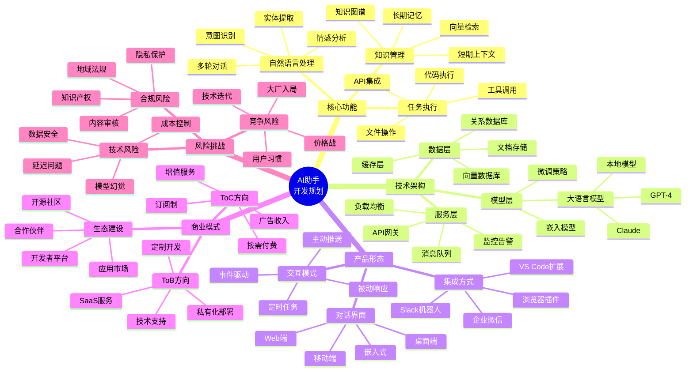
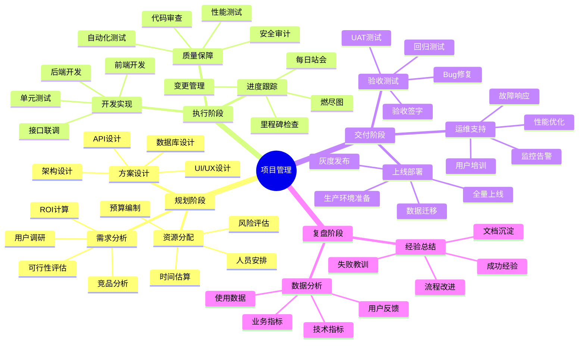
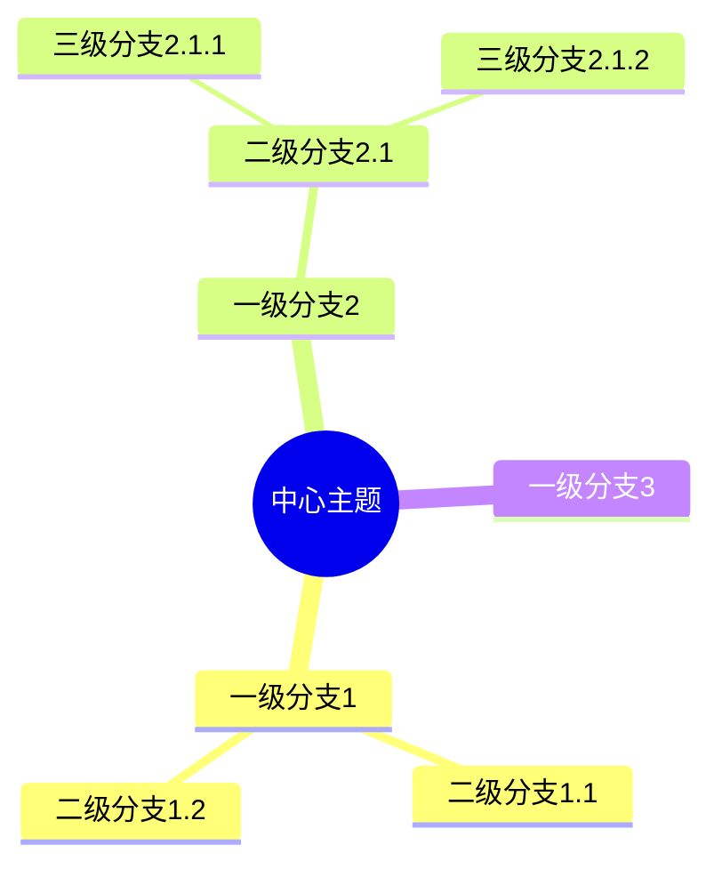

# 思维导图示例



---

## 另一个示例：项目管理系统



---

## 如何在 Obsidian 中使用

1. 安装 **Mermaid Tools** 插件 或启用内置 Mermaid 支持
2. 在笔记中插入代码块，标记为 `mermaid`
3. 使用 `mindmap` 语法开始绘制

### 基础语法

```markdown

```

### 样式选项

| 符号 | 含义 |
|------|------|
| `root((文本))` | 圆形根节点 |
| `root[文本]` | 方形节点 |
| `root(文本)` | 圆角矩形 |
| `root{文本}` | 菱形节点 |
| `root>文本]` | 旗帜形状 |

需要我帮你生成其他类型的图表吗？比如流程图、时序图、甘特图？
